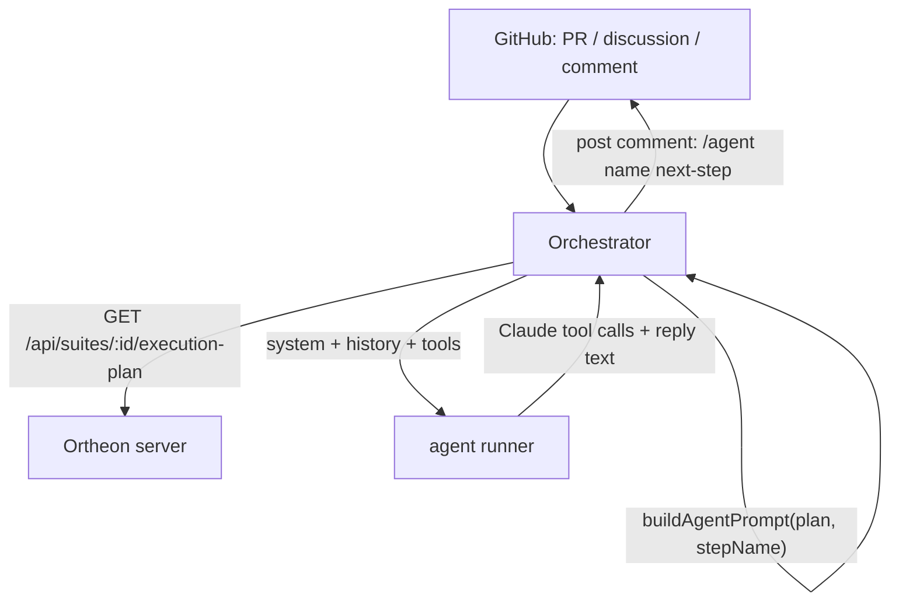

# Agent specs

Agent specs are the second kind of Ortheon spec. Where a behavioral spec describes what must be true about a system (via `browser()` and `api()` steps), an agent spec describes the steps an LLM-driven agent progresses through and the tools it can call.

---

## Overview



Ortheon's job: author agent specs, compile them to JSON-serializable plans, validate, and serve. The orchestrator owns event watching, history building, and dispatch to the agent runner. The agent runner owns the Claude loop and tool execution (it provides shell access for standard `git`/`gh`/`curl` operations).

---

## Quick example

```ts
import { agent, agentStep, tool } from 'ortheon'

export default agent('deploy-agent', {
  system:
    'You are a deployment bot. You have shell access (git, gh, etc.) ' +
    'so use those for standard developer work. Only call the tools below for ' +
    'actions not available via the shell.',

  steps: [
    agentStep('plan',
      "Read the PR with `gh pr view` and draft release notes. " +
      "When ready, post '/agent deploy-agent review' to advance."),
    agentStep('review',
      "Post the release notes for review. Ask the user to post " +
      "'/agent deploy-agent ship' once they approve."),
    agentStep('ship',
      'Call trigger-deploy for the production environment. ' +
      'Do not post any /agent line when done; the run is complete.'),
  ],

  tools: [
    tool('trigger-deploy', {
      description: 'Trigger an internal deployment pipeline. Not available via gh/git.',
      args: { env: { type: 'string', required: true } },
    }),
  ],
})
```

---

## DSL reference

### `agent(name, config)`

Creates an `AgentSpec`. The name must be kebab-case.

```ts
agent(name: string, config: {
  system: Resolvable<string>
  steps: AgentStep[]      // required, at least one
  tools: Array<ConversationTool | Toolset>
}): AgentSpec
```

### `agentStep(name, prompt)`

Creates an `AgentStep`. The name must be kebab-case and unique within the agent.

```ts
agentStep(name: string, prompt: Resolvable<string>): AgentStep
```

### `tool(name, config)`

Creates a `ConversationTool`. Tools are reserved for actions Claude cannot perform through the agent runner's general shell access.

```ts
tool(name: string, config: {
  description?: Resolvable<string>
  args?: ArgSpec
}): ConversationTool
```

`ArgSpec` is `Record<string, ArgField>` where:

```ts
type ArgField = {
  type: 'string' | 'number' | 'boolean'
  required?: boolean
  description?: string
}
```

### `toolset(name, tools[])`

Groups tools for sharing across agents. Toolsets are flattened at compile time.

```ts
toolset(name: string, tools: ConversationTool[]): Toolset
```

---

## Compiled `AgentPlan` shape

`compileAgent(spec)` produces:

```ts
type AgentPlan = {
  specName: string
  system: Resolvable<string>      // env()/secret() preserved unresolved
  steps: AgentStep[]
  tools: SerializedTool[]         // Anthropic-shaped tool definitions
  dispatchReference: string       // auto-generated LLM instructions
}

type SerializedTool = {
  name: string
  description?: Resolvable<string>
  input_schema: {
    type: 'object'
    properties: Record<string, { type: ArgType; description?: string }>
    required: string[]
  }
}
```

The `tools` array is ready to be passed to the Anthropic Claude API as native tool definitions.

The `dispatchReference` lists the agent name, steps in order, and the `/agent` syntax for keeping or advancing the step. It is included in the output of `buildAgentPrompt()`.

---

## `buildAgentPrompt(plan, stepName)`

Constructs the system prompt and Anthropic-shaped tool list to send to the agent runner for a given agent run.

```ts
export type AgentPromptPayload = {
  prompt: string          // system + step header + dispatch reference
  tools: SerializedTool[] // Anthropic-shaped tool definitions from plan.tools
}

export function buildAgentPrompt(plan: AgentPlan, stepName: string): AgentPromptPayload
```

Throws if `stepName` is not found among `plan.steps`.

`prompt` format:

```
<system prompt>

Step "<stepName>" (<position> of <total>):
<step prompt>

<dispatchReference rendered for this step>
```

The dispatch reference section instructs the LLM how to stay on the current step or advance, and warns it not to post any `/agent` line on the final step.

`tools` is `plan.tools` verbatim — the Anthropic `input_schema` objects produced by `compileAgent()`. Pass both `prompt` and `tools` to the agent runner in a single call.

---

## `parseAgentDispatch(text)`

Parses a PR / comment / discussion body for `/agent` dispatch lines.

```ts
export function parseAgentDispatch(text: string): Array<{
  agentName: string
  stepName?: string   // undefined means "start at the first step"
  raw: string
}>
```

Parsing rules:
1. Strip code fences (`` ``` ... ``` ``) and blockquote lines (`> ...`)
2. Match lines with: `^\s*\/agent\s+([a-z0-9][a-z0-9-]*)(?:\s+([a-z0-9][a-z0-9-]*))?\s*$`
3. `stepName` is `undefined` for the bare `/agent <name>` form; the orchestrator treats this as "start at step 1"
4. Results are returned in order of appearance

---

## Step-based dispatch and approval

The step mechanism replaces both explicit workflow gates and separate approval primitives:

- **LLM advances**: the LLM posts `/agent deploy-agent review` in a comment to move to the next step
- **Human approves**: the user posts the same `/agent deploy-agent ship` line to ungate the next step

Both are parsed by the same `parseAgentDispatch()` call in the orchestrator. No special approval primitive is needed.

---

## Validator rules (`validateAgent`)

- `system` must be non-empty (string or dynamic value). `secret()` triggers a warning.
- `steps` must be a non-empty array.
- Each `steps[i].name` must be kebab-case and unique within the agent.
- Each `steps[i].prompt` must be non-empty (or a dynamic value).
- Tool names must be kebab-case and globally unique across all inline tools and toolsets.
- Arg field names must be kebab-case.
- Arg field types must be `string | number | boolean`.

---

## Server integration

`GET /api/suites/:id/execution-plan` for an agent returns:

```json
{
  "planType": "agent",
  "planVersion": 2,
  "plan": {
    "specName": "deploy-agent",
    "system": "...",
    "steps": [{ "name": "plan", "prompt": "..." }, ...],
    "tools": [{ "name": "trigger-deploy", "description": "...", "input_schema": {...} }],
    "dispatchReference": "..."
  },
  "validation": { "errors": [], "warnings": [] }
}
```

`GET /api/suites/:id` for an agent returns `stepNames`, `stepCount`, `toolNames`, `toolCount`.

---

## Design notes

**Why dispatch-by-comment instead of workflow gates?**

The previous workflow model required a separate spec type, separate compilation pipeline, explicit `approveBefore`/`approveAfter` fields, and a gate tracking mechanism in the orchestrator. This added complexity without adding expressive power: human approval was always just "a human has to do something before the next step runs."

The dispatch-by-comment model is simpler: the human posts `/agent name step` in a PR comment, and the orchestrator receives it exactly as it would receive an LLM-generated comment. No special cases. The agent spec encodes what the LLM should tell the human to type.

**Why are tools restricted to non-shell-synthesizable actions?**

The agent runner provides shell access. Claude can use `git`, `gh`, `curl`, and any other standard developer tool through that shell. Defining `read-pr` or `merge-pr` as Ortheon tools would duplicate capabilities Claude already has. Tools in Ortheon are reserved for internal APIs, platform-specific integrations, and other actions that are not reachable via the command line.
